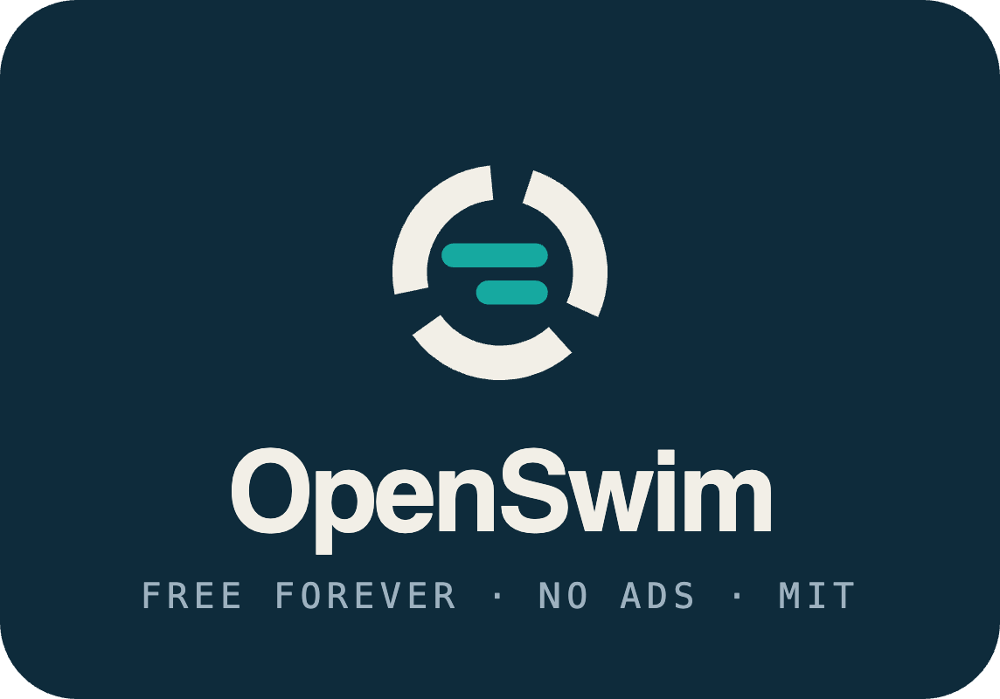

<p align="center">
  
</p>

<p align="center">
  <strong>Swim team ops. Meet day timing. Live results.</strong><br />
  Free forever — no ads, no paywalls, built for small-town teams.
</p>

<p align="center">
  <a href="docs/onboarding.md"></a>
  <a href="LICENSE"></a>
  <a href="docs/roadmap.md"></a>
</p>

---

## Why OpenSwim exists

Small-town and summer-league teams deserve the same polish big clubs pay for — without stacking subscriptions.

Today that usually means a frankenstein setup:

| Need | Typical paid / limited tools |
|------|------------------------------|
| Rosters, chat, schedules | TeamSnap |
| Phone timing & scoring | Swimmingly |
| Live heat sheets & results | SwimminglyFan |

Towns either **cut features**, **pay for multiple apps**, or **both**. OpenSwim’s bet is one open stack that covers the whole meet weekend — from signing up swimmers to printing ribbon labels — and stays **free and ad-free**.

## The product

OpenSwim is the clubhouse, the deck, and the parent’s pocket:

| Who | What they get |
|-----|----------------|
| **Coaches & managers** | Orgs, seasons, rosters, meet entries, scoring, team chat |
| **Timers & scorekeepers** | Native phone/iPad timing huddle — starter pulse, lane stops, verify & publish |
| **Parents & fans** | Live heat sheets, results, rankings, race-aware updates |

### Meet day, paperless

1. Seed a dual meet and share the heat sheet  
2. Volunteers join the huddle (QR) as starter / timer / scorekeeper  
3. Times sync live → scorekeeper verifies → parents see results  
4. Export ribbon labels for the award table  

Native **SwiftUI** and **Kotlin Compose** apps handle timing on purpose: clock sync and deck reliability beat cross-platform compromises.

### Beyond one Saturday

- Track swimmers across seasons and years  
- Rankings and team scores during the meet  
- Manager ↔ parent chat (schedules & volunteers later)  
- League / multi-team formats and Hy-Tek-style interop on the roadmap  

Full story: [roadmap](docs/roadmap.md) · [backlog](docs/backlog/epics.md) · [competitor map](docs/competitors.md)

## Stack

| Layer | Choice |
|-------|--------|
| API | Go + Postgres + WebSockets |
| Web | Next.js (App Router) · TypeScript |
| iOS / iPad | Native SwiftUI |
| Android | Native Kotlin Compose |
| Contracts | OpenAPI in `packages/contracts` |

## Status

**Phase 0 — scaffold.** Docs, monorepo layout, and agent metadata are here. App runtimes are **not** bootstrapped yet — perfect time to shape the product and docs. Runnable local apps come with Phase 0 boot.

## Dive in

| I want to… | Go here |
|------------|---------|
| Set up my machine | **[Onboarding guide](docs/onboarding.md)** |
| Send a change | [Contributing](CONTRIBUTING.md) |
| See what’s planned | [Roadmap](docs/roadmap.md) · [Tasks](docs/backlog/tasks.md) |
| Learn the domain | [Domain model](docs/domain-model.md) |
| Report a vulnerability | [Security](SECURITY.md) |

Community: [Contributors](CONTRIBUTORS.md) · [Code of Conduct](CODE_OF_CONDUCT.md) · [MIT License](LICENSE)

## Repository map

```text
apps/api           Go API              (scaffold)
apps/web           Next.js web         (scaffold)
apps/ios           SwiftUI             (scaffold)
apps/android       Compose             (scaffold)
brand/             marks, icons, lockups, social preview
packages/          contracts, tokens
docs/              roadmap, onboarding, agents
skills/            portable Agent Skills
.github/           CODEOWNERS, PR template (see ABOUT.md)
```

## For coding agents

Start at **[AGENTS.md](AGENTS.md)**. Details in [docs/agents/](docs/agents/). Skills in [skills/](skills/). Harness adapters (`CLAUDE.md`, `.cursor/rules/`, …) are pointers only — don’t fork the rules.

---

<p align="center">
  <sub>Built for the pool deck — not the paywall.</sub>
</p>
